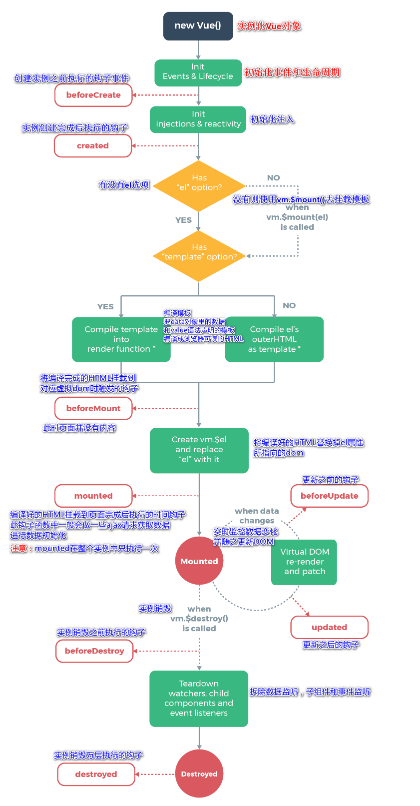

# 1、什么是Axios

  Axios是一个开源的可以用在浏览器端和`Node JS`的异步通信框架， 她的主要作用就是实现AJAX异步通信，其功能特点如下：

- 从浏览器中创建`XMLHttpRequests`
- 从node.js创建http请求
- 支持Promise API[JS中链式编程]
- 拦截请求和响应
- 转换请求数据和响应数据
- 取消请求
- 自动转换JSON数据
- 客户端支持防御XSRF(跨站请求伪造)

  GitHub：[https://github.com/axios/axios](https://github.com/axios/axios)
  中文文档：[http://www.axios-js.com/](http://www.axios-js.com/)

## 1.1、为什么要使用Axios

​         由于`Vue.js`是一个视图层框架并且作者(尤雨溪) 严格准守SoC(关注度分离原则)所以`Vue.js`并不包含AJAX的通信功能， 为了解决通信问题， 作者单独开发了一个名为`vue-resource`的插件， 不过在进入2.0版本以后停止了对该插件的维护并推荐了`Axios`框架。少用jQuery， 因为它操作Dom太频繁!

# 2、第一个Axios应用程序

  咱们开发的接口大部分都是采用JSON格式， 可以先在项目里模拟一段JSON数据， 数据内容如下：创建一个名为data.json的文件并填入上面的内容， 放在项目的根目录下

```json
{
  "name": "狂神说Java",
  "url": "https://blog.kuangstudy.com",
  "page": 1,
  "isNonProfit": true,
  "address": {
    "street": "含光门",
    "city": "陕西西安",
    "country": "中国"
  },
  "links": [
    {
      "name": "bilibili",
      "url": "https://space.bilibili.com/95256449"
    },
    {
      "name": "狂神说Java",
      "url": "https://blog.kuangstudy.com"
    },
    {
      "name": "百度",
      "url": "https://www.baidu.com/"
    }
  ]
}
```

**测试代码**

```html
<!DOCTYPE html>
<html lang="en" xmlns:v-binf="http://www.w3.org/1999/xhtml">
<head>
    <meta charset="UTF-8">
    <title>Title</title>
    <!--v-cloak 解决闪烁问题-->
    <style>
        [v-cloak]{
            display: none;
        }
    </style>
</head>
<body>
<div id="vue"  v-cloak>
    <div>地名：{{info.name}}</div>
    <div>地址：{{info.address.country}}--{{info.address.city}}--{{info.address.street}}</div>
    <div>链接：<a v-bind:href="info.url" target="_blank">{{info.url}}</a> </div>
</div>

<!--引入js文件-->
<script src="https://cdn.jsdelivr.net/npm/vue@2.5.21/dist/vue.min.js"></script>

<script src="https://unpkg.com/axios/dist/axios.min.js"></script>
<script type="text/javascript">
    var vm = new Vue({
        el:"#vue",
        //data：属性：vm
        data(){
            return{
                info:{
                    name:null,
                    address:{
                        country:null,
                        city:null,
                        street:null
                    },
                    url:null
                }
            }
        },
        mounted(){//钩子函数
            axios
                .get('data.json')
                .then(response=>(this.info=response.data));
        }
    });
</script>


</body>
</html>
```

说明：

1. v-cloak解决页面闪烁问题（不会出现{{message}}这样的信息）
2. 在这里使用了v-bind将a:href的属性值与Vue实例中的数据进行绑定
3. 使用axios框架的get方法请求AJAX并自动将数据封装进了Vue实例的数据对象中
4. 我们在data中的数据结构必须和`Ajax`响应回来的数据格式匹配！

# 3、Vue的生命周期

  官方文档：https://cn.vuejs.org/v2/guide/instance.html#生命周期图示
  Vue实例有一个完整的生命周期，也就是从开始创建初女台化数据、编译模板、挂载DOM、渲染一更新一渲染、卸载等一系列过程，我们称这是Vue的生命周期。通俗说就是Vue实例从创建到销毁的过程，就是生命周期。
  在Vue的整个生命周期中，它提供了一系列的事件，可以让我们在事件触发时注册JS方法，可以让我们用自己注册的JS方法控制整个大局，在这些事件响应方法中的this直接指向的是Vue的实例。



