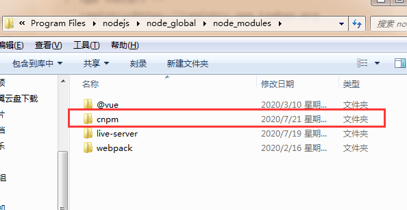
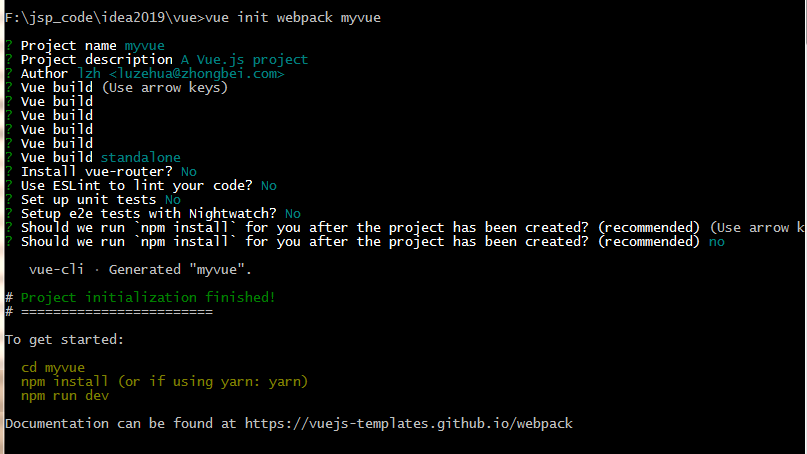
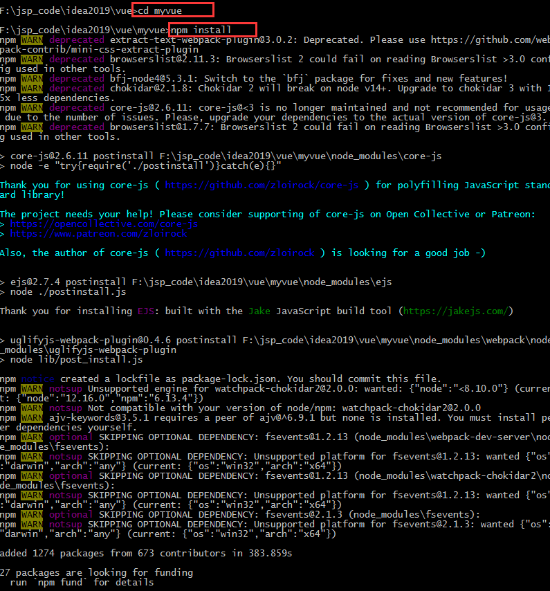
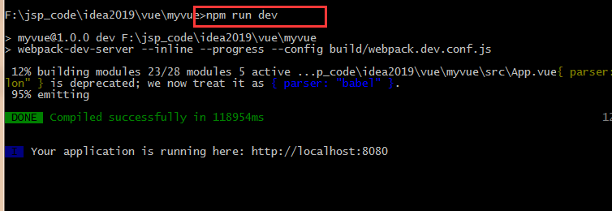
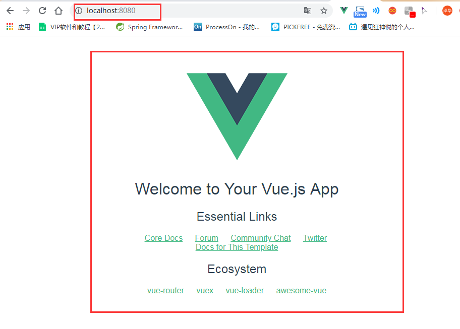
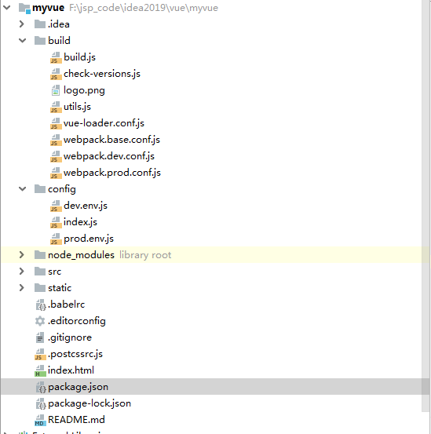
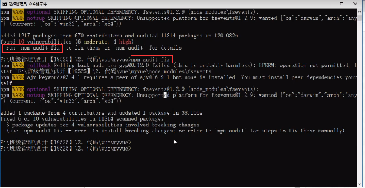

# 1、什么是vue-cli

- vue-cli官方提供的一个脚手架，用于快速生成一个vue的项目模板
- 预先定义好的目录结构及基础代码，就好比咱们在创建Maven项目时可以选择创建一个骨架项目，这个估计项目就是脚手架，我们的开发更加的快速；

**主要的功能**

- 统一的目录结构
- 本地调试
- 热部署
- 单元测试
- 集成打包上线

# 2、需要的环境

**安装nodejs：**

- Node.js：http://nodejs.cn/download/
    安装就是无脑的下一步就好，安装在自己的环境目录下
- Git：https://git-scm.com/doenloads
- 镜像：https://npm.taobao.org/mirrors/git-for-windows/

- cmd下输入`node -v`，查看是否能够正确打印出版本号即可！
- cmd下输入`npm -v`，查看是否能够正确打印出版本号即可！
  - 这个npm，就是一个软件包管理工具，就和linux下的apt软件安装差不多！

**安装Node.js淘宝镜像加速器（cnpm）**

```
# -g 就是全局安装
npm install cnpm -g

# 或使用如下语句解决npm速度慢的问题
npm install --registry=https://registry.npm.taobao.org
```

  安装的过程可能有点慢~，耐心等待！虽然安装了cnpm，但是尽量少用！
  安装的位置

- 默认:`C:\Users\administrator\AppData\Roaming\npm`

- 我改路径之后：`D:\Program Files\nodejs\node_global\node_modules`

  

  

**安装vue-cli**

```sql
cnpm instal1 vue-cli-g
#测试是否安装成功#查看可以基于哪些模板创建vue应用程序，通常我们选择webpack
vue list
```

# 3、第一个vue-cli应用程序

1.创建一个Vue项目，我们随便建立一个空的文件夹在电脑上，我这里在D盘下新建一个目录

```
D:\Project\vue-study;
```

2.创建一个基于webpack模板的vue应用程序

```sql
#1、首先需要进入到对应的目录 cd D:\Project\vue-study
#2、这里的myvue是顶日名称，可以根据自己的需求起名
vue init webpack myvue
```

一路都选择no即可；
**说明：**

- Project name：项目名称，默认回车即可
- Project description：项目描述，默认回车即可
- Author：项目作者，默认回车即可
- Install vue-router：是否安装vue-router，选择n不安装（后期需要再手动添加）
- Use ESLint to lint your code:是否使用ESLint做代码检查，选择n不安装（后期需要再手动添加)
- Set up unit tests:单元测试相关，选择n不安装（后期需要再手动添加）
- Setupe2etests with Nightwatch：单元测试相关，选择n不安装（后期需要再手动添加）
- Should we run npm install for you after the,project has been created:创建完成后直接初始化，选择n，我们手动执行；运行结果！



## 初始化

```
cd myvue
npm install
```



## 运行

```
npm run dev
```





执行完成后，目录多了很多依赖



当出现问题时，可以查看提示进行处理如下
