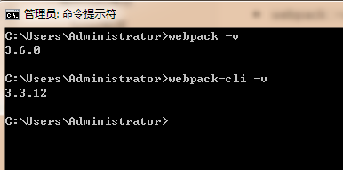

# 什么是Webpack

- 本质上， webpack是一个现代JavaScript应用程序的静态模块打包器(module bundler) 。当webpack处理应用程序时， 它会递归地构建一个依赖关系图(dependency graph) ， 其中包含应用程序需要的每个模块， 然后将所有这些模块打包成一个或多个bundle.
- Webpack是当下最热门的前端资源模块化管理和打包工具， 它可以将许多松散耦合的模块按照依赖和规则打包成符合生产环境部署的前端资源。还可以将按需加载的模块进行代码分离，等到实际需要时再异步加载。通过loader转换， 任何形式的资源都可以当做模块， 比如Commons JS、AMD、ES 6、CSS、JSON、Coffee Script、LESS等；
- 伴随着移动互联网的大潮， 当今越来越多的网站已经从网页模式进化到了WebApp模式。它们运行在现代浏览器里， 使用HTML 5、CSS 3、ES 6等新的技术来开发丰富的功能， 网页已经不仅仅是完成浏览器的基本需求； WebApp通常是一个SPA(单页面应用) ， 每一个视图通过异步的方式加载，这导致页面初始化和使用过程中会加载越来越多的JS代码，这给前端的开发流程和资源组织带来了巨大挑战。
- 前端开发和其他开发工作的主要区别，首先是前端基于多语言、多层次的编码和组织工作，其次前端产品的交付是基于浏览器的，这些资源是通过增量加载的方式运行到浏览器端，如何在开发环境组织好这些碎片化的代码和资源，并且保证他们在浏览器端快速、优雅的加载和更新，就需要一个模块化系统，这个理想中的模块化系统是前端工程师多年来一直探索的难题。

## 模块化的演进

### Script标签

```html
	<script src = "module1.js"></script>
	<script src = "module2.js"></script>
	<script src = "module3.js"></script>
```

  这是最原始的JavaScript文件加载方式，如果把每一个文件看做是一个模块，那么他们的接口通常是暴露在全局作用域下，也就是定义在window对象中，不同模块的调用都是一个作用域。
  这种原始的加载方式暴露了一些显而易见的弊端：

- 全局作用域下容易造成变量冲突
- 文件只能按照`<script>`的书写顺序进行加载
- 开发人员必须主观解决模块和代码库的依赖关系
- 在大型项目中各种资源难以管理，长期积累的问题导致代码库混乱不堪

### **CommonsJS**

------

  服务器端的NodeJS遵循CommonsJS规范，该规范核心思想是允许模块通过require方法来同步加载所需依赖的其它模块，然后通过exports或module.exports来导出需要暴露的接口。

```javascript
require("module");
require("../module.js");
export.doStuff = function(){};
module.exports = someValue;
```

  **优点：**

- 服务器端模块便于重用
- NPM中已经有超过45万个可以使用的模块包
- 简单易用

  **缺点：**

- 同步的模块加载方式不适合在浏览器环境中，同步意味着阻塞加载，浏览器资源是异步加载的
- 不能非阻塞的并行加载多个模块

  **实现：**

- 服务端的NodeJS
- •Browserify，浏览器端的CommonsJS实现，可以使用NPM的模块，但是编译打包后的文件体积较大
- modules-webmake，类似Browserify，但不如Browserify灵活
- wreq，Browserify的前身

### **AMD**

------

  Asynchronous Module Definition规范其实主要一个主要接口define(id?,dependencies?,factory);它要在声明模块的时候指定所有的依赖dependencies，并且还要当做形参传到factory中，对于依赖的模块提前执行。

```javascript
define("module",["dep1","dep2"],functian(d1,d2){
	return someExportedValue;
});
require（["module","../file.js"],function(module，file){});
```

  **优点**

- 适合在浏览器环境中异步加载模块
- 可以并行加载多个模块

  **缺点**

- 提高了开发成本，代码的阅读和书写比较困难，模块定义方式的语义不畅
- 不符合通用的模块化思维方式，是一种妥协的实现

实现

- RequireJS
- curl

### **CMD**

------

  Commons Module Definition规范和AMD很相似，尽保持简单，并与CommonsJS和NodeJS的Modules规范保持了很大的兼容性。

```javascript
define(function(require,exports,module){
	var $=require("jquery");
	var Spinning = require("./spinning");
	exports.doSomething = ...;
	module.exports=...;
});
```

**优点：**

- 依赖就近，延迟执行
- 可以很容易在NodeJS中运行缺点
- 依赖SPM打包，模块的加载逻辑偏重

**实现**

- Sea.js
- coolie

### ES6模块

------

  EcmaScript 6标准增加了JavaScript语言层面的模块体系定义。ES 6模块的设计思想， 是尽量静态化， 使编译时就能确定模块的依赖关系， 以及输入和输出的变量。Commons JS和AMD模块，都只能在运行时确定这些东西。

```javascript
import "jquery"
export function doStuff(){}
module "localModule"{}
```

  **优点**

- 容易进行静态分析
- 面向未来的EcmaScript标准

  **缺点**

- 原生浏览器端还没有实现该标准
- 全新的命令，新版的Node JS才支持

  **实现**

- Babel

  **大家期望的模块**
  系统可以兼容多种模块风格， 尽量可以利用已有的代码， 不仅仅只是JavaScript模块化， 还有CSS、图片、字体等资源也需要模块化。

# 安装Webpack

  WebPack是一款模块加载器兼打包工具， 它能把各种资源， 如JS、JSX、ES 6、SASS、LESS、图片等都作为模块来处理和使用。
  **安装：**

```javascript
npm install webpack -g
npm install webpack-cli -g
```

  测试安装成功

- `webpack -v`
- `webpack-cli -v`

!

## 配置

  创建 `webpack.config.js`配置文件

- entry：入口文件， 指定Web Pack用哪个文件作为项目的入口
- output：输出， 指定WebPack把处理完成的文件放置到指定路径
- module：模块， 用于处理各种类型的文件
- plugins：插件， 如：热更新、代码重用等
- resolve：设置路径指向
- watch：监听， 用于设置文件改动后直接打包

```js
module.exports = {
	entry:"",
	output:{
		path:"",
		filename:""
	},
	module:{
		loaders:[
			{test:/\.js$/,;\loade:""}
		]
	},
	plugins:{},
	resolve:{},
	watch:true
}
```

  直接运行`webpack`命令打包

# 使用webpack

1. 创建项目（创建一个空文件夹，用idea打开）
2. 创建一个名为modules的目录，用于放置JS模块等资源文件
3. 在modules下创建模块文件，如hello.js，用于编写JS模块相关代码

```js
//暴露一个方法
exports.sayHi = function() {
    document.write("<h1>狂神说ES6</h1>")
}
```

1. 在modules下创建一个名为main.js的入口文件，用于打包时设置entry属性

```js
//require 导入一个模块，就可以调用这个模块中的方法了
var hello = require("./hello");
hello.sayHi();
```

1. 在项目目录下创建webpack.config.js配置文件，使用webpack命令打包

```js
module.exports = {
	entry:"./modules/main.js",
	output:{
		filename:"./js/bundle.js"
	}

}
```

1. 在项目目录下创建HTML页面，如index.html，导入webpack打包后的JS文件

```html
<!doctype html>
<html lang="en">
    <head>
        <meta charset="UTF-8">
        <title>狂神说Java</title>
    </head>
    <body>
        <script src="dist/js/bundle.js"></script>
    </body>
</html>
```

1. 在IDEA控制台中直接执行webpack；如果失败的话，就使用管理员权限运行即可！
2. 运行HTML看效果

  **说明**

```shell
# 参数--watch 用于监听变化
webpack --watch
```